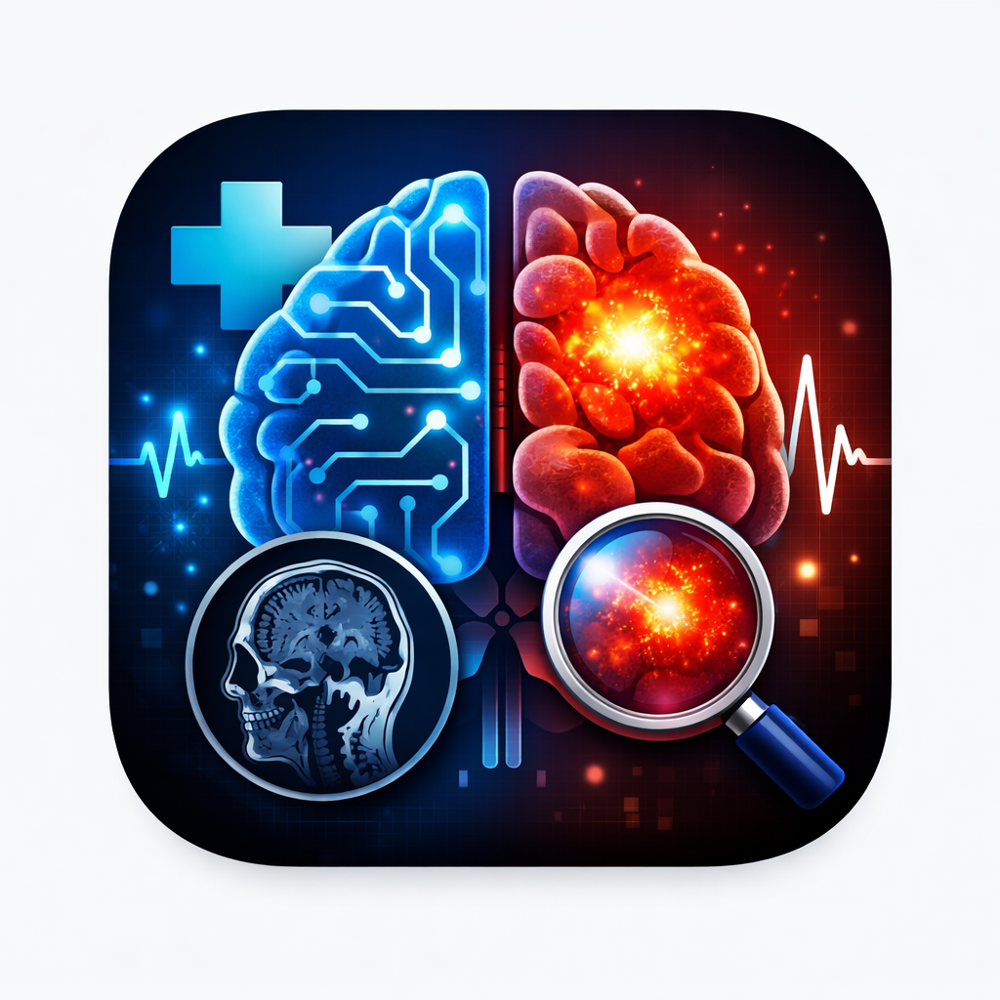
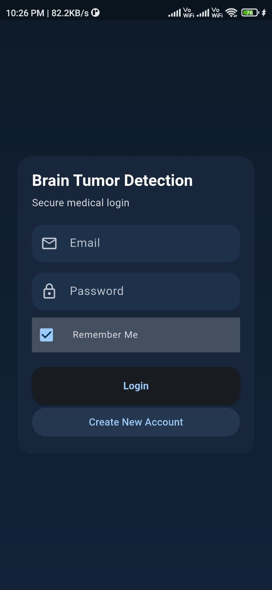
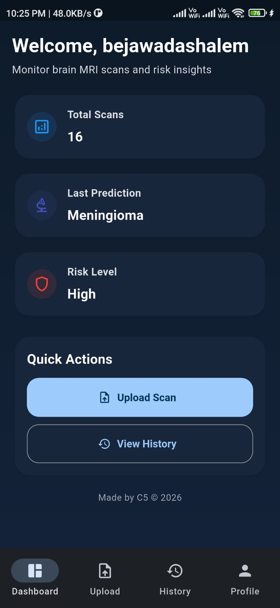
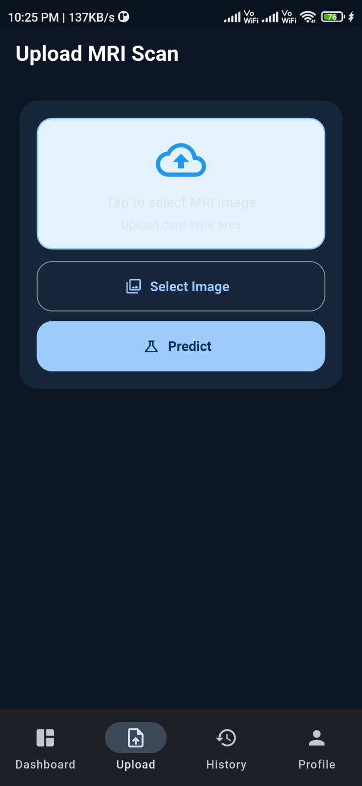
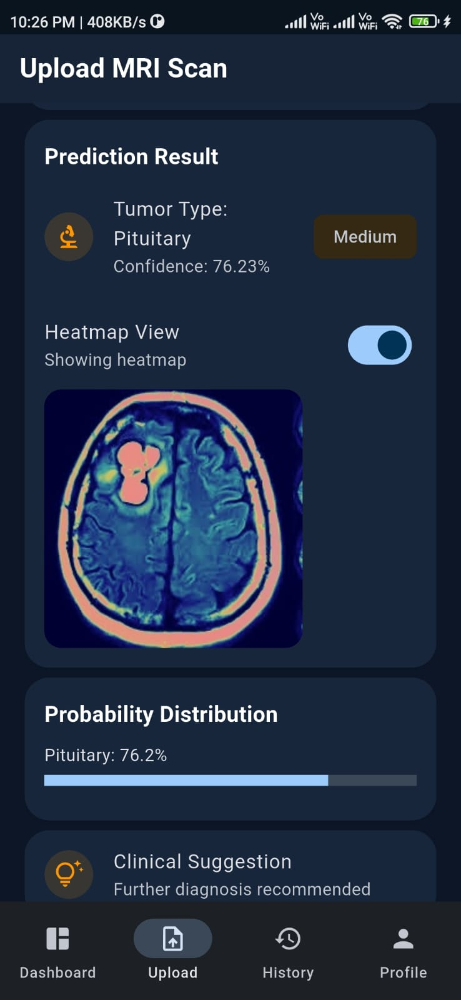
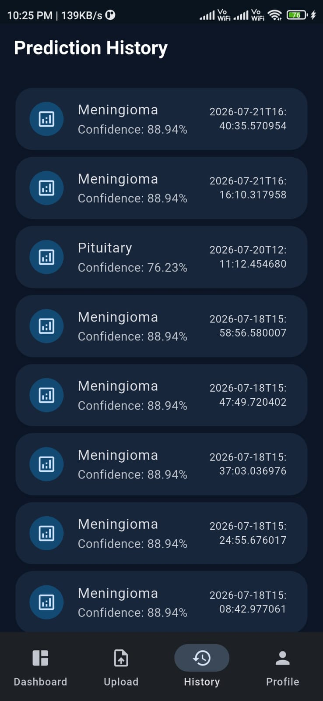
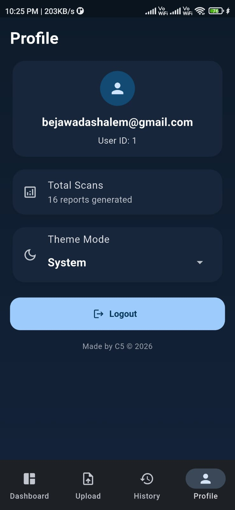
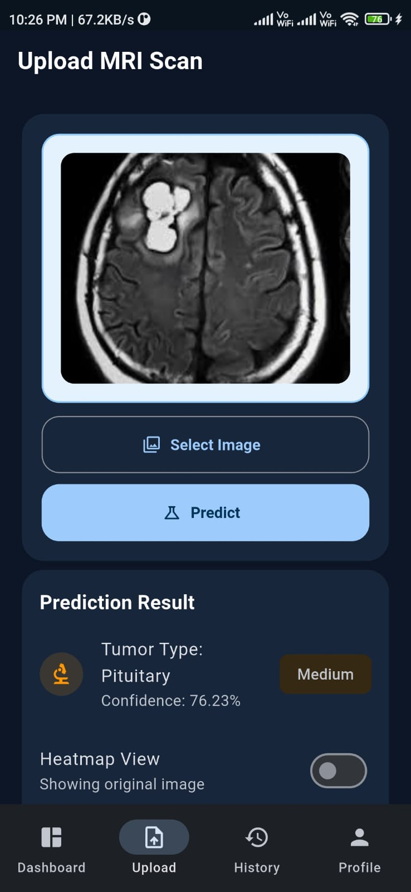

# 🧠 Brain Tumor Detection - Flutter Application

A modern Flutter mobile application that enables users to upload MRI brain scans, receive AI-powered tumor predictions, visualize model-generated heatmaps, and manage their prediction history. The app communicates with a Flask REST API deployed on Render, providing fast and reliable real-time predictions.

---
## 
<p align="center">
  
</p>

## 🔗 Project Ecosystem

🌐 **Live Backend API**  
https://brain-tumor-api-zg3b.onrender.com

⚙️ **Backend Repository**  
https://github.com/shalemraju1/brain-tumor-api

👨‍💻 **Developer Portfolio**  
https://portfolio-lime-one-10.vercel.app

---

## ✨ Features

- 🔐 User Registration & Login
- 🧠 AI-based Brain Tumor Detection
- 📤 MRI Image Upload
- 📊 Confidence Score & Risk Assessment
- 🔥 Heatmap Visualization
- 📄 Prediction Report Generation
- 📜 Prediction History
- 👤 User Profile Management
- 🌙 Modern Dark Theme UI
- ☁️ Real-time Backend Integration

---

# 📱 Application Screenshots

## Login



---

## Dashboard



---

## Prediction



---

## Prediction Result



---

## Prediction History



---

## User Profile



---

## Working Demo



---

# 🛠️ Tech Stack

| Category | Technology |
|----------|------------|
| Framework | Flutter |
| Language | Dart |
| Backend | Flask REST API |
| AI Model | TensorFlow Lite |
| Database | PostgreSQL |
| Authentication | Session-Based |
| Storage | SharedPreferences |
| Deployment | Render |

---

# ☁️ Backend Integration

The application communicates with the deployed Flask backend.

**API Base URL**

```
https://brain-tumor-api-zg3b.onrender.com
```

---

# 🚀 Getting Started

## Clone Repository

```bash
git clone https://github.com/shalemraju1/brain-tumor-flutter-app.git
```

---

## Install Dependencies

```bash
flutter pub get
```

---

## Run the Application

```bash
flutter run
```

---

# 📦 Build APK

### Debug APK

```bash
flutter build apk
```

### Release APK

```bash
flutter build apk --release
```

---

# 📂 Project Structure

```
lib/
│
├── screens/
├── widgets/
├── services/
├── models/
├── utils/
└── main.dart
```

---

# ⚙️ Configuration

Before running the application, ensure:

- Flutter SDK is installed
- Android SDK is configured
- Internet permission is enabled
- Backend API URL is correctly configured

---

# 🔮 Future Enhancements

- Push Notifications
- Multi-language Support
- Offline Prediction Cache
- Explainable AI Dashboard
- Cloud Report Backup
- Biometric Authentication
- Doctor Consultation Module

---

# 👨‍💻 Author

**Shalem Raju Bejawada**

- GitHub: https://github.com/shalemraju1
- LinkedIn: https://www.linkedin.com/in/shalem-raju-bejawada-170b40290/

Developed as a Final Year AI/ML Project using Flutter, Flask, TensorFlow Lite, and PostgreSQL.